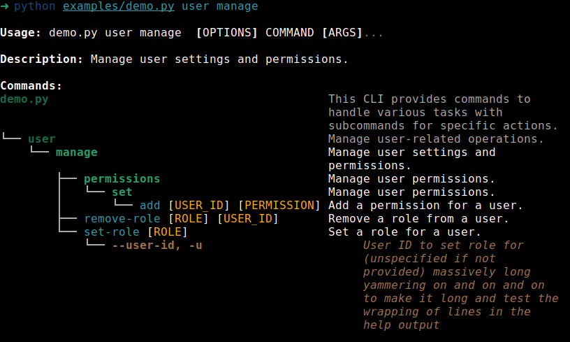

# TreeClick

A Click extension that provides tree-formatted help messages for CLI commands and groups.

## Installation

You can install TreeClick using pip:

```bash
pip install treeclick
```

## Usage

Import `TreeGroup` and `TreeCommand` from `treeclick` and use them instead of Click's `Group` and `Command`.

Configuration is set on the root `TreeGroup` and automatically propagated to subgroups.

### Example

```python
import click
from treeclick import TreeGroup, TreeCommand

cli = TreeGroup(name="mycli", help="My CLI tool.", use_tree=True, max_width=100, connector_width=3)

subgroup = TreeGroup(name="sub", help="Sub group")
cli.add_command(subgroup)

@subgroup.command(name="hello", cls=TreeCommand)
@click.argument("name")
def hello(name):
    """Say hello to someone."""
    click.echo(f"Hello, {name}!")

if __name__ == "__main__":
    cli()
```

- Configuration (use_tree, max_width, connector_width) on the root `cli` will apply to all subgroups and commands.

Running `python mycli.py --help` will display a tree-formatted (or indented) help message consistently.

For a more complex example, see `examples/demo.py`.



## Features

- Tree-structured or indented help output using Rich.
- Automatic handling of subcommands and options.
- Dimmed higher-level hierarchy in help for subcommands.
- Consistent formatting across levels.
- Configurable visualization style, width, and connectors (2 or 3 wide).
- Configuration propagation from root to subgroups.

## License

MIT

